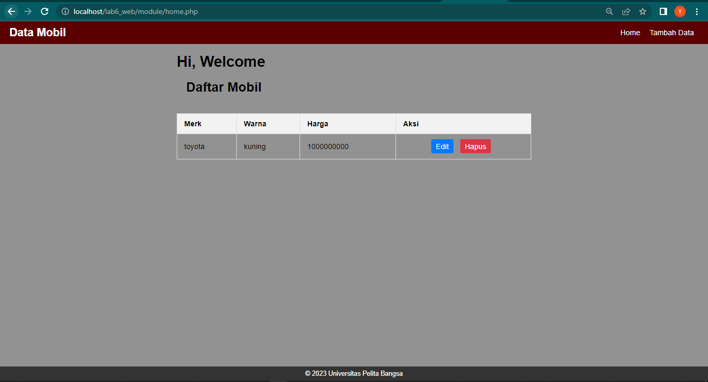
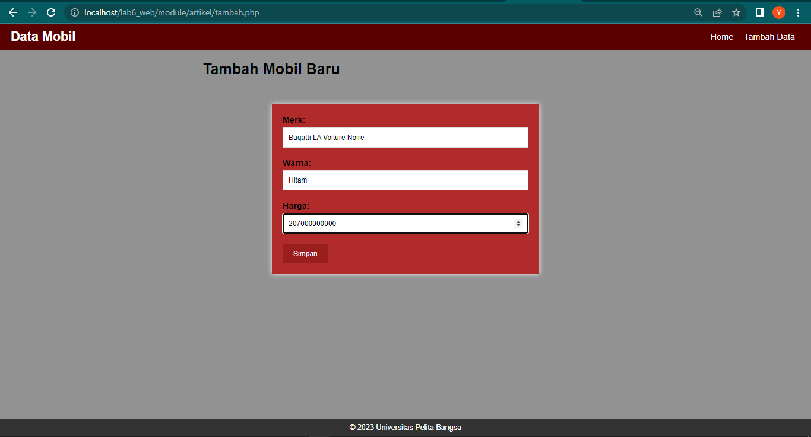
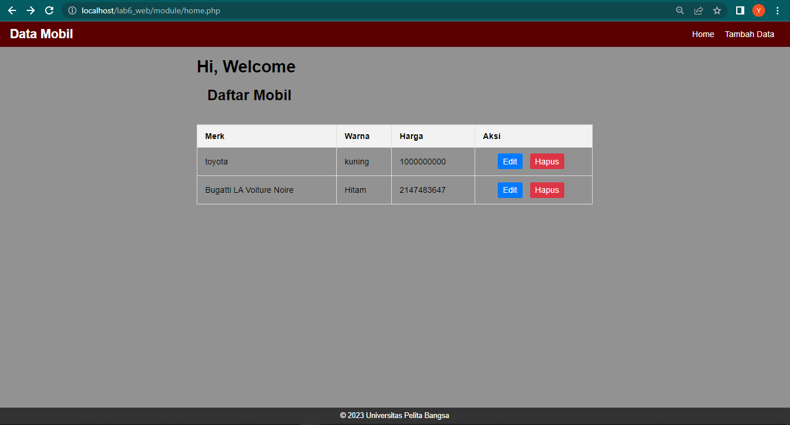
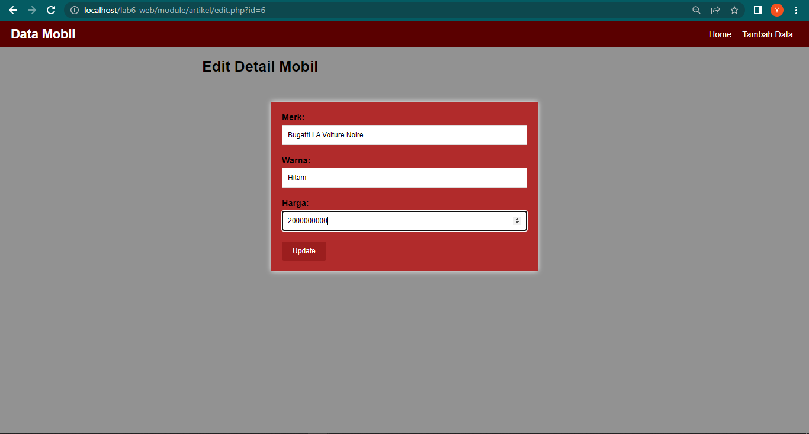
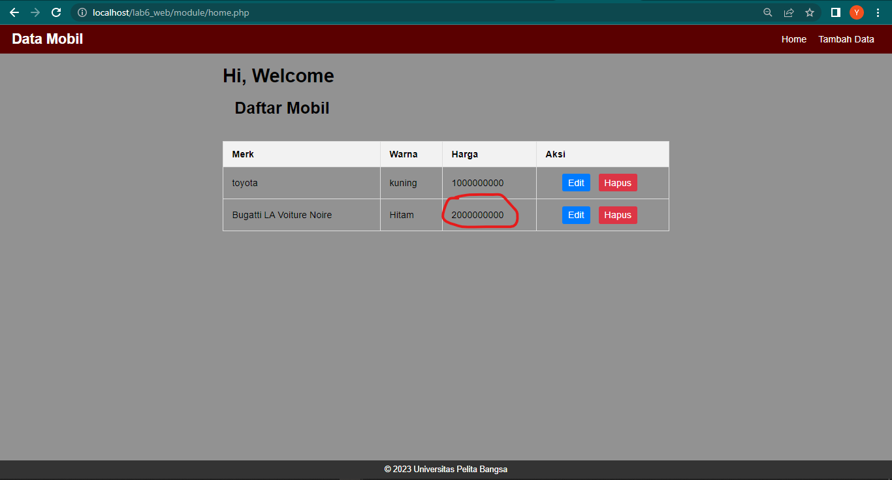
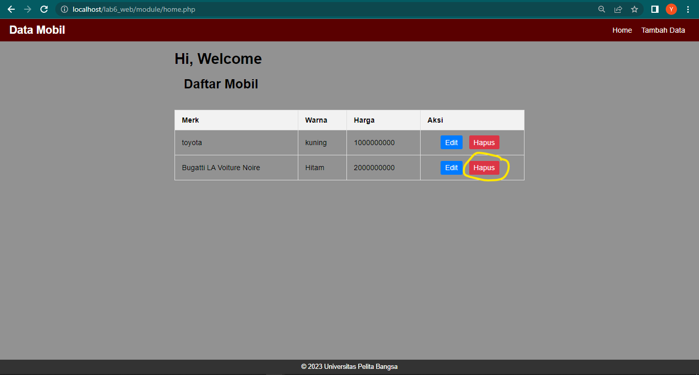
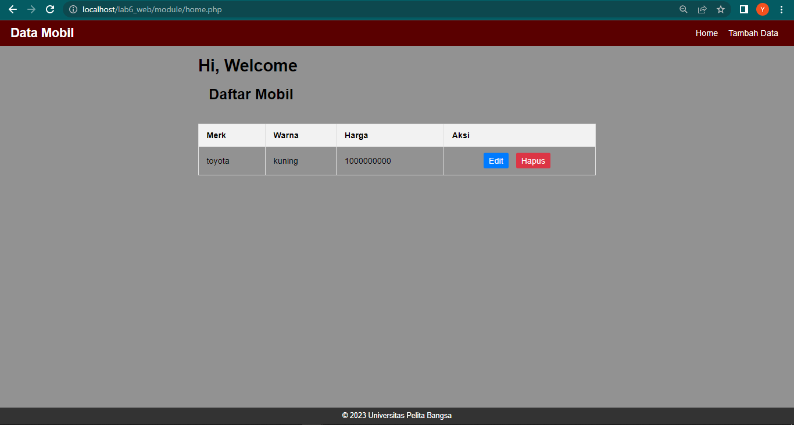

# Lab6Web
# Praktikum 6: OOP Lanjutan

### Instruksi Praktikum
1. Persiapkan text editor misalnya VSCode.
2. Buat folder baru dengan nama lab6_php_oop pada docroot webserver (htdocs)
3. Ikuti langkah-langkah praktikum yang akan dijelaskan berikutnya.

# Langkah Praktikum

##### Copy file library (class) dari praktikum 5 dan letakkan pada folder class.

###### Buat file template yang berisi template dan css untuk header, dan footer.

###### Buat modul artikel yang berisi CRUD dengan memanfaatkan library database dan form tersbut.

###### File index.php berisi proses routing aplikasi dan dikombinasikan dengan penggunaan mod_rewrite pada file .htaccess

##### - Berikut adalah hasilnya :

Home

Tambah

Edit

Hapus

### SEKIAN, TUGAS PRAKTIKUM 6 YANG BERISI KONSEP OOP LANJUTAN DAN HASIL DARI PROGRAM TERSEBUT MENGGUNAKAN BAHASA PEMROGRAMAN PHP MELALUI APLIKASI VSCODE, TERIMAKASIH!
